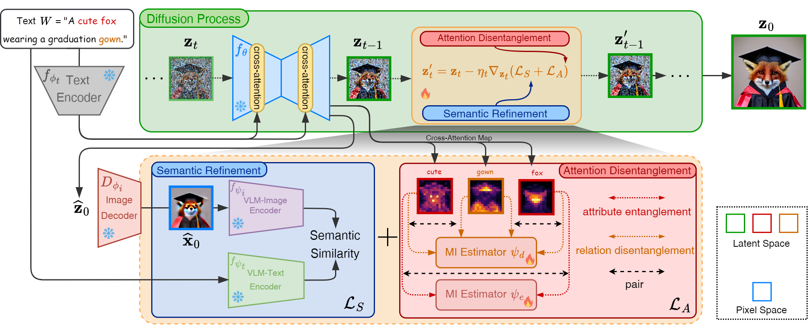

# Semantic-Diffusion-Model-with-Attention-Disentanglement-for-Text-to-Image

## Create a virtual environment
create a conda enviroment 
```
    conda env create -f environment.yml
```

activate the environment
```
    conda activate semantic-diffusion
```

then download spaCy model
```
    python -m spacy download en_core_web_trf
```

or you can install the required packages manually
```
    pip install -r requirements.txt
```

## How to run
```
    python run.py --prompt "a cute fox wearing a graduation gown"
```
output will be saved in `./output.png`